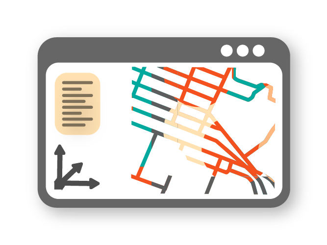
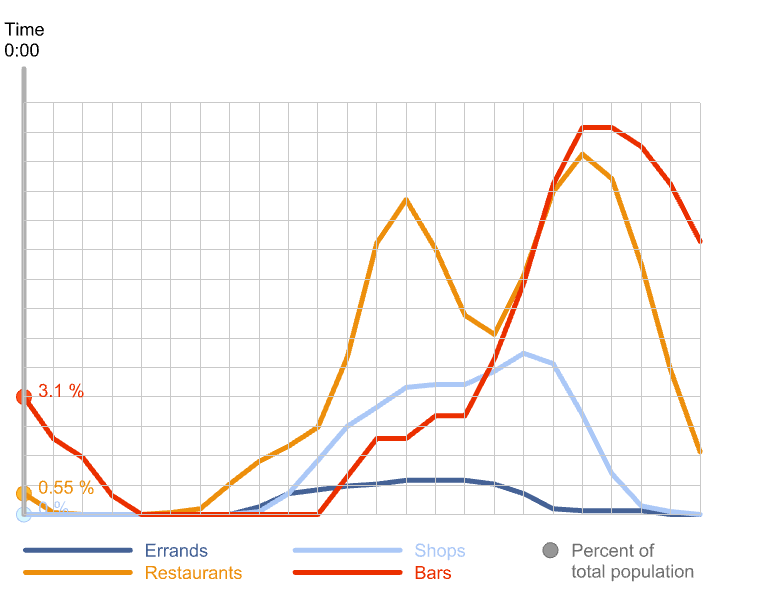
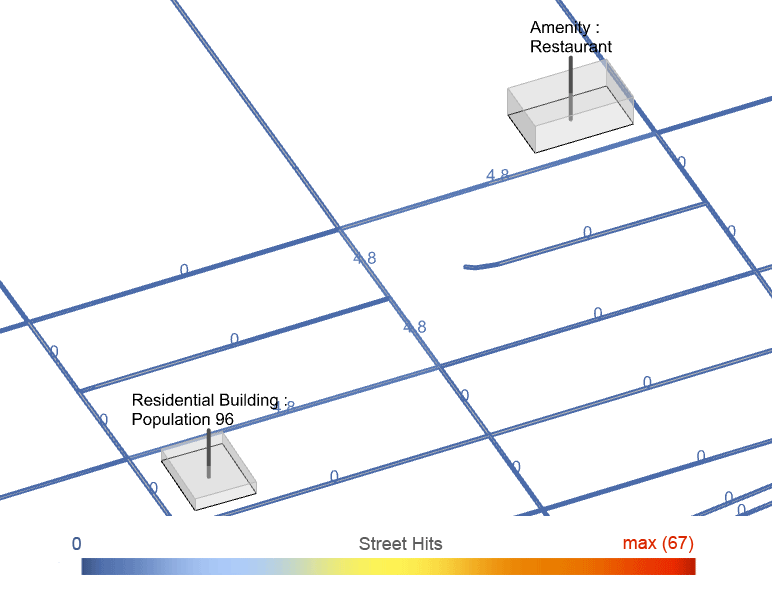
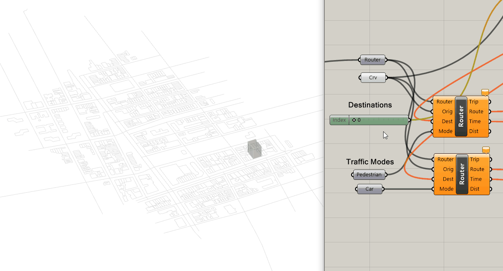
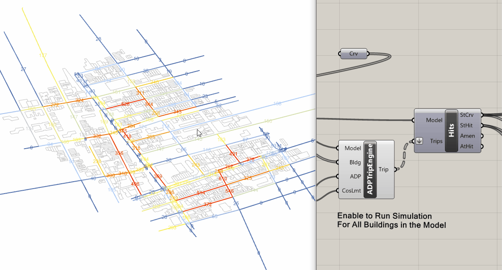
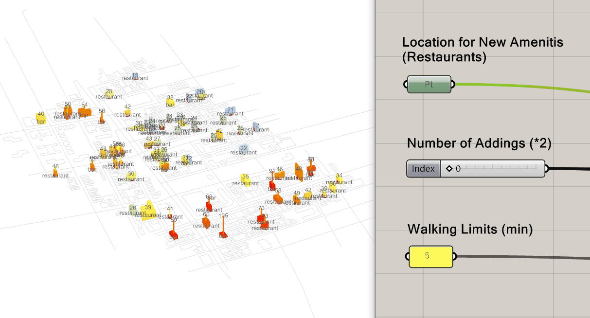

# Urbano v1

!!! warning "End of Life (EOL)"
    Urbano v1 has reached end of life and will not be further developed.
    This documentation is maintained for reference and existing projects only.

Please find the component documentation on the following pages.

## 🚀 Features

A preview of what Urbano enables you to do

-   { width="240" loading=lazy .skip-lightbox .center alt="" }

    ---

    __DOWNLOAD GEOSPATIAL DATA__

    Download maps and points-of-interest data from **OpenStreetMap** directly in Grasshopper.

-   { width="240" loading=lazy .skip-lightbox .center alt="" }

    ---

    __IMPORT & AGGREGATE DATA__

    Parse and merge layers from OSM or shapefiles into a single coherent project model.

-   { width="240" loading=lazy .skip-lightbox .center alt="" }

    ---

    __LOOK-UP & MODIFY METADATA__

    Attach, query and parametrically edit metadata on any geometric object.

-   { width="240" loading=lazy .skip-lightbox .center alt="" }

    ---

    __BUILD MOBILITY MODEL__

    Auto-generate a topological street network and building access points ready for simulation.

-   { width="240" loading=lazy .skip-lightbox .center alt="" }

    ---

    __MULTI-MODAL ROUTING__

    Compute fastest paths for pedestrians, cyclists or cars between origins and destinations.

-   { width="240" loading=lazy .skip-lightbox .center alt="" }

    ---

    __SIMULATE WITH TRIP ENGINE__

    Launch activity-based simulations using Amenity Demand Profiles (ADP).

-   { width="240" loading=lazy .skip-lightbox .center alt="" }

    ---

    __ANALYSE AMENITIES & STREETS__

    Evaluate Streetscore, Amenityscore and Walkscore to assess vitality and accessibility.

-   { width="240" loading=lazy .skip-lightbox .center alt="" }

    ---

    __INTEGRATED CAD WORKFLOW__

    Bake geometry with metadata back to Rhino and visualise results instantly.

---

## 📊 Metrics

-   { width="460" loading=lazy .center alt="" }

    ---

    __AMENITY DEMAND PROFILE__

    Spatiotemporal distribution of human activities; default data provided and fully editable.

-   { width="460" loading=lazy .center alt="" }

    ---

    __STREETSCORE__

    Counts *Street Hits* to show how many simulated trips use each street segment.

-   { width="460" loading=lazy .center alt="" }

    ---

    __AMENITYSCORE__

    Compares amenity demand (Amenity Hits) with supply to reveal over- or under-served areas.

-   { width="460" loading=lazy .center alt="" }

    ---

    __WALKSCORE__

    Calculates a 0-100 walkability rating with customisable weightings.

---

## 🛠️ Samples

Use cases with Urbano components

-   { width="500" loading=lazy .center alt="" }

    ---

    __URBANO TEMPLATES__

    *Import Urbano Template* - starter files that demonstrate each core workflow.

-   { width="500" loading=lazy .center alt="" }

    ---

    __ROUTING__

    *Router* - compute shortest paths, distances and travel times for multiple traffic modes.

-   { width="500" loading=lazy .center alt="" }

    ---

    __ACCESSIBILITY WITHIN DISTANCE__

    *Router* - visualise all buildings reachable from an origin within a chosen threshold.

-   { width="500" loading=lazy .center alt="" }

    ---

    __TRIPS FROM GIVEN ORIGIN__

    *ADP Trip Engine & Inspect Trip* - split population by ADP and send trips to valid amenities.

-   { width="500" loading=lazy .center alt="" }

    ---

    __STREETSCORE (ADD LINK)__

    *ADP Trip Engine & Street Hits* - add or remove links and see Street Hits update instantly.

-   { width="500" loading=lazy .center alt="" }

    ---

    __AMENITYSCORE (ADD POPULATION)__

    *ADP Trip Engine & Amenity Hits* - add building occupants and observe nearby amenity utilisation.

-   { width="500" loading=lazy .center alt="" }

    ---

    __AMENITYSCORE (ADD AMENITIES)__

    *ADP Trip Engine & Amenity Hits* - insert new amenities to balance supply and demand.

-   { width="500" loading=lazy .center alt="" }

    ---

    __AMENITYSCORE (ADP TIME STEPS)__

    *ADP & Trip Engine* - run 24-hour simulations to capture temporal variations.

-   { width="500" loading=lazy .center alt="" }

    ---

    __WALKSCORE (ADD AMENITIES)__

    *Trip Engine & Walkscore* - add missing amenities to improve walkability scores.

---

## Step 1 — Downloading Map Data

  <iframe
    src="https://www.youtube.com/embed/mwNlGaMVBns"
    title="Step 1 — Downloading Map Data"
    allow="accelerometer; autoplay; clipboard-write; encrypted-media; gyroscope; picture-in-picture; web-share"
    referrerpolicy="strict-origin-when-cross-origin"
    allowfullscreen
    loading="lazy">
  </iframe>

## Step 2 — Importing and Modeling

  <iframe
    src="https://www.youtube.com/embed/NA1vpiR7vFI"
    title="Step 2 — Importing and Modeling"
    allow="accelerometer; autoplay; clipboard-write; encrypted-media; gyroscope; picture-in-picture; web-share"
    referrerpolicy="strict-origin-when-cross-origin"
    allowfullscreen
    loading="lazy">
  </iframe>

## Step 3 — Site Analysis

  <iframe
    src="https://www.youtube.com/embed/KMT0TOODwdY"
    title="Step 3 — Site Analysis"
    allow="accelerometer; autoplay; clipboard-write; encrypted-media; gyroscope; picture-in-picture; web-share"
    referrerpolicy="strict-origin-when-cross-origin"
    allowfullscreen
    loading="lazy">
  </iframe>

## Step 4 — Evaluating Design Scenarios

  <iframe
    src="https://www.youtube.com/embed/n1u3WJTBb30"
    title="Step 4 — Evaluating Design Scenarios"
    allow="accelerometer; autoplay; clipboard-write; encrypted-media; gyroscope; picture-in-picture; web-share"
    referrerpolicy="strict-origin-when-cross-origin"
    allowfullscreen
    loading="lazy">
  </iframe>

## Step 5 — Generative Approach

  <iframe
    src="https://www.youtube.com/embed/rlrk0SwV4Do"
    title="Step 5 — Generative Approach"
    allow="accelerometer; autoplay; clipboard-write; encrypted-media; gyroscope; picture-in-picture; web-share"
    referrerpolicy="strict-origin-when-cross-origin"
    allowfullscreen
    loading="lazy">
  </iframe>

