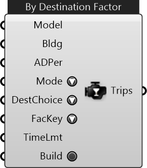

##  ADP Trip Engine

Generate trips from the building based on the given activity demand profile and the destination choice model for each activity in the profile

#### Inputs
* ##### Model []
Urbano model containing buildings with amenities and network
* ##### Bldg []
Building as origin of trips
* ##### ADPer []
Activity Demand Profile (trips are produced for each activity entry in the profile
* ##### Mode []
Travel mode for the trips
* ##### DestChoice []
Destination choice model for each activity. It defines whether to produce one or multiple trips per activity in the ADP
* ##### FacKey []
A necessary input for By-Destination-Factor model. Please ensure the input/selected metadata keys are existing in the model.
* ##### TimeLmt []
A necessary input for By-Destination-Factor model. It defines the travel time limit when searching for the available destinations. 
* ##### Build []
Toggle to start building Urbano model

#### Outputs
* ##### Trips
Trips generated by the engine according to the ADP

[Check Hydra Example Files for ADP Trip Engine](https://hydrashare.github.io/hydra/index.html?keywords=ADP Trip Engine)