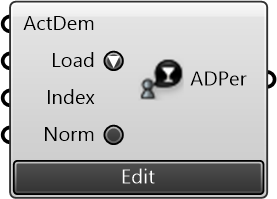

##  Activity Demand Profile / Persona

Activity Demand Profile describing the population weighted demand of activities for a certain persona type. Either input profile data, or load from stock data provided by Urbano. Loaded data can then be edited and saved in the ADP editor. You can even start creating a profile from scratch in the editor

#### Inputs
* ##### ActDem []
Activities and their corresponding weights in comma separated lists
* ##### Load []
Load Activity Demand Profile data in CSV format from the dropdown / File Path / URL
* ##### Index []
One-based index for the column to use if the ADP data includes multiple columns (normally to indicate different time intervals)
* ##### Norm []
Normalize the demand weights to sum to 1

#### Outputs
* ##### ADPer
Activity Demand Profile describing the weighted demand of activities of a certain persona type

[Check Hydra Example Files for Activity Demand Profile / Persona](https://hydrashare.github.io/hydra/index.html?keywords=Activity Demand Profile / Persona)