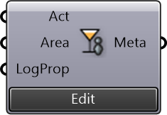

##  Amenity Capacity

Calculate amenity capacity based on the area and activity

#### Inputs
* ##### Act []
Activity conducted in the amenity
* ##### Area []
Built area of the amenity, assign -1 to use default area for the activity
* ##### LogProp []
Logistics area proportion of the amenity, default = 0.2

#### Outputs
* ##### Meta
Metadata containing the "ameinty_capacity" value (deconstruct to use the value itself)

[Check Hydra Example Files for Amenity Capacity](https://hydrashare.github.io/hydra/index.html?keywords=Amenity Capacity)