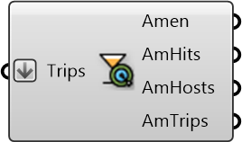

#  Amenity Hits

Hits at amenities in the given trips

#### Inputs
* ##### Trips []
Trips that are used to compute hits

#### Outputs
* ##### Amen
Amenity hosting certain activities for people to do
* ##### AmHits
A counter that tallies up the total number of people that are sent to a certain amenity on all trips
* ##### AmHosts
Amenity Hosts
* ##### AmTrips
Trips that were to that amenity