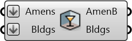

##  Arrange Amenities By Building

Arrange points (amenities, geotagged metadata from other sources) by the closest building

#### Inputs
* ##### Amens []
List of amenities represented by points with metadata embedded (can be plain points too for just arranging)
* ##### Bldgs []
Building footprints to examine and place points into

#### Outputs
* ##### AmenB
List of amenities for each building
* ##### Bldgs
Same Buildings in order

[Check Hydra Example Files for Arrange Amenities By Building](https://hydrashare.github.io/hydra/index.html?keywords=Arrange Amenities By Building)