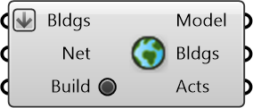

##  Build Urbano Model

Build an Urbano model with buildings and streets

#### Inputs
* ##### Bldgs []
Building curves in the model
* ##### Net []
Street Network
* ##### Build []
Toggle to start building Urbano model

#### Outputs
* ##### Model
Urbano model containing buildings with amenities and network
* ##### Bldgs
Curves representing buildings in the Urbano model
* ##### Acts
Activities for which amenities are present in the Urbano model

[Check Hydra Example Files for Build Urbano Model](https://hydrashare.github.io/hydra/index.html?keywords=Build Urbano Model)