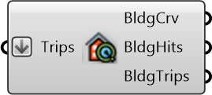

##  Building Hits

Buildings that were destination for the given trips

#### Inputs
* ##### Trips []
Trips that are used to compute hits

#### Outputs
* ##### BldgCrv
Destination Buildings curves
* ##### BldgHits
Building hits - number of people  that took trips to that building
* ##### BldgTrips
Trips that go to that building

[Check Hydra Example Files for Building Hits](https://hydrashare.github.io/hydra/index.html?keywords=Building Hits)