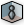
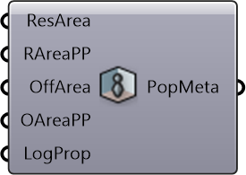

#  Building Population

Calculate the population in a building using area data

#### Inputs
* ##### ResArea []
Residential area of building (will be 0 if not assigned)
* ##### RAreaPP []
Residential area per person, default = 40
* ##### OffArea []
Office area of building (will be 0 if not assigned)
* ##### OAreaPP []
Office area per person, default = 14
* ##### LogProp []
Logistics area proportion of the building, default = 0.2

#### Outputs
* ##### PopMeta
Metadata containing population data for a building (can merge with building metadata before creating building)