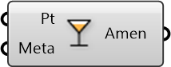

##  Create Amenity

Build amenity from point and metadata

#### Inputs
* ##### Pt []
Point representing location of amenity
* ##### Meta []
Serializable dictionary with string keys and arbitrary values

#### Outputs
* ##### Amen
Point with amenity metadata embedded

[Check Hydra Example Files for Create Amenity](https://hydrashare.github.io/hydra/index.html?keywords=Create Amenity)