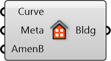

##  Create Building

Create a building with given curve and metadata.

#### Inputs
* ##### Curve []
Closed polygon for the building footprint
* ##### Meta []
Serializable dictionary with string keys and arbitrary values
* ##### AmenB []
List of amenities for each building (optional)

#### Outputs
* ##### Bldg
Building curve with metadata and amenities embedded

[Check Hydra Example Files for Create Building](https://hydrashare.github.io/hydra/index.html?keywords=Create Building)