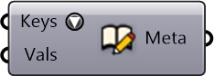

##  Create Metadata

Create metadata from field names (keys) and corresponding values.

#### Inputs
* ##### Keys []
Field names (keys) in the metadata
* ##### Vals []
Values corresponding to keys in the metadata

#### Outputs
* ##### Meta
Serializable dictionary with string keys and arbitrary values

[Check Hydra Example Files for Create Metadata](https://hydrashare.github.io/hydra/index.html?keywords=Create Metadata)