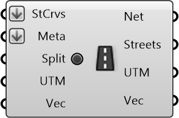

##  Create Street Network

Create street network from curves

#### Inputs
* ##### StCrvs []
Curves represting streets in the network
* ##### Meta []
Serializable dictionary with string keys and arbitrary values
* ##### Split []
Preprocessing: split the street curves to get more  accurate routing results
* ##### UTM []
UTM Zone of the given region (can be used along with translation vector) to transform data from different sources to a common origin)
* ##### Vec []
Translation vector to move from actual UTM window to working origin (can be used to transform data from different sources to a common origin)

#### Outputs
* ##### Net
Street Network
* ##### Streets
Processed street curves from the network
* ##### UTM
UTM Zone of the given region (can be used along with translation vector) to transform data from different sources to a common origin)
* ##### Vec
Translation vector to move from actual UTM window to working origin (can be used to transform data from different sources to a common origin)

[Check Hydra Example Files for Create Street Network](https://hydrashare.github.io/hydra/index.html?keywords=Create Street Network)