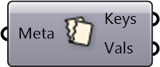

##  Deconstruct Metadata

Deconstruct Metadata into keys and values

#### Inputs
* ##### Meta []
Serializable dictionary with string keys and arbitrary values

#### Outputs
* ##### Keys
Keys in metadata
* ##### Vals
Values in metadata

[Check Hydra Example Files for Deconstruct Metadata](https://hydrashare.github.io/hydra/index.html?keywords=Deconstruct Metadata)