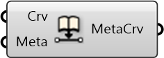

##  Embed Metadata into Curve

Embed Metadata into curve

#### Inputs
* ##### Crv []
Curve to embed metadata to
* ##### Meta []
Serializable dictionary with string keys and arbitrary values

#### Outputs
* ##### MetaCrv
Curve with metadata embedded

[Check Hydra Example Files for Embed Metadata into Curve](https://hydrashare.github.io/hydra/index.html?keywords=Embed Metadata into Curve)