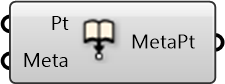

##  Embed Metadata into Point

Embed metadata into point

#### Inputs
* ##### Pt []
Point to embed metadata into
* ##### Meta []
Serializable dictionary with string keys and arbitrary values

#### Outputs
* ##### MetaPt
Point with metadata embedded

[Check Hydra Example Files for Embed Metadata into Point](https://hydrashare.github.io/hydra/index.html?keywords=Embed Metadata into Point)