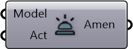

##  Find Amenities

Find amenities for an activity in the model

#### Inputs
* ##### Model []
Urbano model containing buildings with amenities and network
* ##### Act []
Activity to look for

#### Outputs
* ##### Amen
Amenity hosting certain activities for people to do

[Check Hydra Example Files for Find Amenities](https://hydrashare.github.io/hydra/index.html?keywords=Find Amenities)