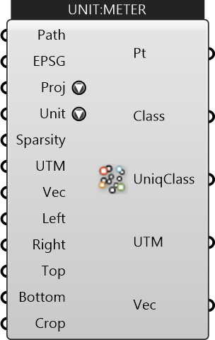

##  Import LAS

Import LAS file. (This component requires to run Rhino as administrator)

#### Inputs
* ##### Path []
Specify the path to the Las file (.las)
* ##### EPSG []
Specify the EPSG of the coordinate reference system
* ##### Proj []
Project geograhic points from source file to UTM (rhino canvas) or WSG84 (lon,lat)
* ##### Unit []
Distance Unit
* ##### Sparsity []
Sparsity of the imported points. The larger the number is, the sparser the points are.
* ##### UTM []
UTM Zone of the given region (can be used along with translation vector) to transform data from different sources to a common origin)
* ##### Vec []
Translation vector to move from actual UTM window to working origin (can be used to transform data from different sources to a common origin)
* ##### Left []
Left Bound (minimum longitude) of the cropped LAS region
* ##### Right []
Right Bound (maximum longitude) of the cropped LAS region
* ##### Top []
Top Bound (maximum latitude) of the cropped LAS region
* ##### Bottom []
Bottom Bound (minimum latitude) of the cropped LAS region
* ##### Crop []
Cropping Geometry

#### Outputs
* ##### Pt
Points imported from the LAS file
* ##### Class
Classifications of the imported points
* ##### UniqClass
Unique classifications of the imported points
* ##### UTM
UTM Zone of the given region (can be used along with translation vector) to transform data from different sources to a common origin)
* ##### Vec
Translation vector to move from actual UTM window to working origin (can be used to transform data from different sources to a common origin)

[Check Hydra Example Files for Import LAS](https://hydrashare.github.io/hydra/index.html?keywords=Import LAS)