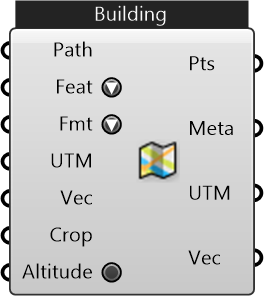

##  Import OSM Features

Import buildings, amenities and other features from an OSM path

#### Inputs
* ##### Path []
File Path or URL for the OSM data. URL resources will be cached.
* ##### Feat []
OSM Feature Type to import
* ##### Fmt []
Format of given OSM data
* ##### UTM []
UTM Zone of the given region (can be used along with translation vector) to transform data from different sources to a common origin)
* ##### Vec []
Translation vector to move from actual UTM window to working origin (can be used to transform data from different sources to a common origin)
* ##### Crop []
Cropping Geometry
* ##### Altitude []
Download the DEM data and match the altitude information for the imported points. (Allow administrator access for Rhino; Wait until the download to be completed in the background and re-enable this component to see the changes)

#### Outputs
* ##### Pts
Points representing the features (could form polyline, polygon, or single point) depending on what is imported
* ##### Meta
Serializable dictionary with string keys and arbitrary values
* ##### UTM
UTM Zone of the given region (can be used along with translation vector) to transform data from different sources to a common origin)
* ##### Vec
Translation vector to move from actual UTM window to working origin (can be used to transform data from different sources to a common origin)

[Check Hydra Example Files for Import OSM Features](https://hydrashare.github.io/hydra/index.html?keywords=Import OSM Features)