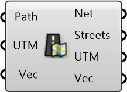

##  Import OSM Street Network

Import Street Network from an OSM path

#### Inputs
* ##### Path []
File Path or URL for the OSM data. URL resources will be cached.
* ##### UTM []
UTM Zone of the given region (can be used along with translation vector) to transform data from different sources to a common origin)
* ##### Vec []
Translation vector to move from actual UTM window to working origin (can be used to transform data from different sources to a common origin)

#### Outputs
* ##### Net
Street Network
* ##### Streets
Processed street curves from the network
* ##### UTM
UTM Zone of the given region (can be used along with translation vector) to transform data from different sources to a common origin)
* ##### Vec
Translation vector to move from actual UTM window to working origin (can be used to transform data from different sources to a common origin)

[Check Hydra Example Files for Import OSM Street Network](https://hydrashare.github.io/hydra/index.html?keywords=Import OSM Street Network)