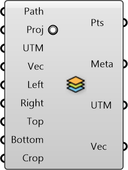

##  Import Shapefile Features

Import data from GIS shapefiles

#### Inputs
* ##### Path []
Specify the path to the shapefile (.shp)
* ##### Proj []
Change the map projection to WGS84 datum (recommended), default is true
* ##### UTM []
UTM Zone of the given region (can be used along with translation vector) to transform data from different sources to a common origin)
* ##### Vec []
Translation vector to move from actual UTM window to working origin (can be used to transform data from different sources to a common origin)
* ##### Left []
Left Bound (Longitude, x-axis) of the OSM region
* ##### Right []
Right Bound (Longitude, x-axis) of the OSM region
* ##### Top []
Top Bound (Latitude, y-axis) of the OSM region
* ##### Bottom []
Bottom Bound (Latitude, y-axis) of the OSM region
* ##### Crop []
Cropping Geometry

#### Outputs
* ##### Pts
Points representing the features (could form polyline, polygon, or single point) depending on what is imported
* ##### Meta
Serializable dictionary with string keys and arbitrary values
* ##### UTM
UTM Zone of the given region (can be used along with translation vector) to transform data from different sources to a common origin)
* ##### Vec
Translation vector to move from actual UTM window to working origin (can be used to transform data from different sources to a common origin)

[Check Hydra Example Files for Import Shapefile Features](https://hydrashare.github.io/hydra/index.html?keywords=Import Shapefile Features)