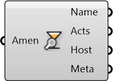

##  Inspect Amenity

Inspect amenities to get properties

#### Inputs
* ##### Amen []
Amenity hosting certain activities for people to do

#### Outputs
* ##### Name
Name of the amenity
* ##### Acts
Activities offered by amenity
* ##### Host
Building that hosts the amenity
* ##### Meta
Serializable dictionary with string keys and arbitrary values

[Check Hydra Example Files for Inspect Amenity](https://hydrashare.github.io/hydra/index.html?keywords=Inspect Amenity)