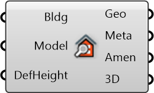

##  Inspect Building

Inspect building to get properties and curve

#### Inputs
* ##### Bldg []
Building curve to inspect
* ##### Model []
Urbano model containing buildings with amenities and network
* ##### DefHeight []
Replace missing building heights with the default height

#### Outputs
* ##### Geo
Geometry of building (footprint)
* ##### Meta
Serializable dictionary with string keys and arbitrary values
* ##### Amen
Amenity hosting certain activities for people to do
* ##### 3D
3D mesh representing building (uses height from metadata)

[Check Hydra Example Files for Inspect Building](https://hydrashare.github.io/hydra/index.html?keywords=Inspect Building)