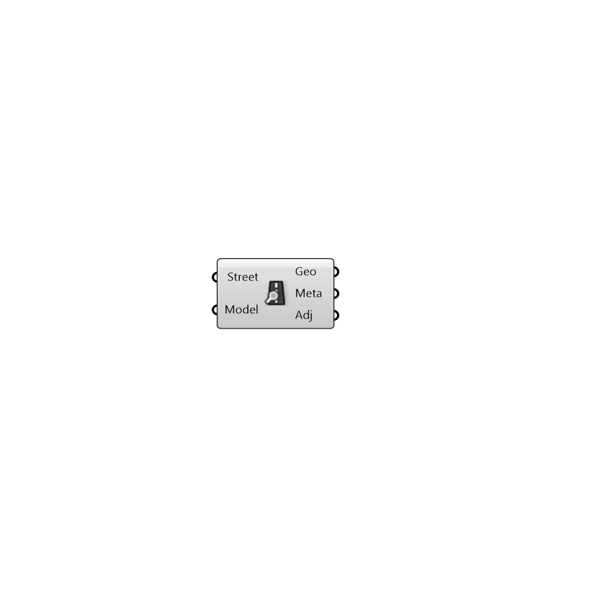

#  Inspect Street Segment

Inspect street segment to get properties and curve

#### Inputs
* ##### Street []
Street Segment curve to inspect
* ##### Model []
Urbano model containing buildings with amenities and network

#### Outputs
* ##### Geo
Geometry of street segment
* ##### Meta
Serializable dictionary with string keys and arbitrary values
* ##### Adj
Buildings in the model that are connected to the street