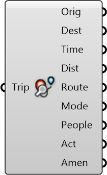

##  Inspect Trip

Inspect trip for details like time, distance, route

#### Inputs
* ##### Trip []
Trip between two locations, including route and metadata

#### Outputs
* ##### Orig
Origin of trip
* ##### Dest
Destination of trip
* ##### Time
Time taken in minutes
* ##### Dist
Distance travelled in meters
* ##### Route
Route (as curve) taken on the trip
* ##### Mode
Mode of this trip
* ##### People
Number of people taking this trip
* ##### Act
Activity for the trip
* ##### Amen
Amenity hosting certain activities for people to do

[Check Hydra Example Files for Inspect Trip](https://hydrashare.github.io/hydra/index.html?keywords=Inspect Trip)