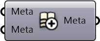

#  Merge Metadata

Merge collection of metadatas

#### Inputs
* ##### Meta []
Metadata to be merged
* ##### Meta []
Metadata to be merged

#### Outputs
* ##### Meta
Serializable dictionary with string keys and arbitrary values