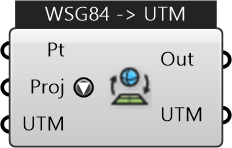

##  Project Geographic Point

Project geographic points between WSG84 (lat,long) and UTM coords

#### Inputs
* ##### Pt []
Point to project
* ##### Proj []
Project geograhic points from Lat-long (WSG84) to UTM and vice-versa
* ##### UTM []
UTM Zone (required for UTM to LatLong conversion) formatted as longZone+latZone, eg. 18F

#### Outputs
* ##### Out
Projected Point
* ##### UTM
UTM Zone (from LatLong to UTM conversion)

[Check Hydra Example Files for Project Geographic Point](https://hydrashare.github.io/hydra/index.html?keywords=Project Geographic Point)