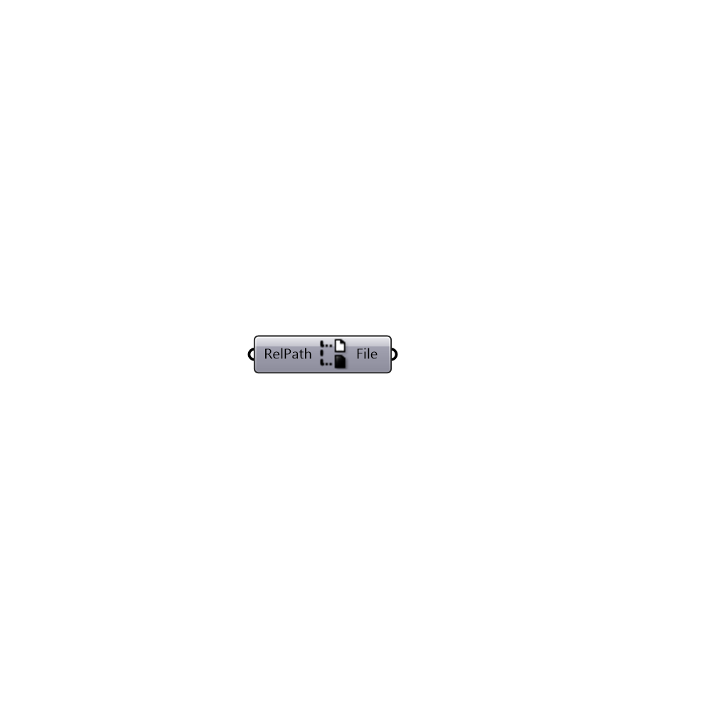

#  Relative File Path

Get absolute path from relative path to directory containing this grasshopper file. This .gh file will need to be saved for this component to work.

#### Inputs
* ##### RelPath []
Relative path to the directory containing this grasshopper file

#### Outputs
* ##### File
Absolute path to the given file