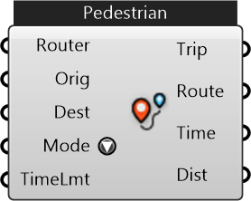

#  Router

Find a trip between two places (buildings/points/curves) using the best mode of the mode options selected

#### Inputs
* ##### Router []
Router (Urbano Model or Street Network) which can be used to find trips
* ##### Orig []
Origin Point/Building
* ##### Dest []
Destination Point/Building
* ##### Mode []
Travel modes to choose from (fastest selected)
* ##### TimeLmt []
Time limit to filter the trips (optional)

#### Outputs
* ##### Trip
Trip between two locations, including route and metadata
* ##### Route
Curve representing the route of the trip
* ##### Time
Time taken in minutes
* ##### Dist
Distance covered in meters