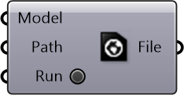

##  Save Urbano Model

Save Urbano Model to file

#### Inputs
* ##### Model []
Urbano model containing buildings with amenities and network
* ##### Path []
File path to create and save Urbano model to
* ##### Run []
Toggle to save (if kept true, will save on every update)

#### Outputs
* ##### File
Path to saved urbano model file

[Check Hydra Example Files for Save Urbano Model](https://hydrashare.github.io/hydra/index.html?keywords=Save Urbano Model)