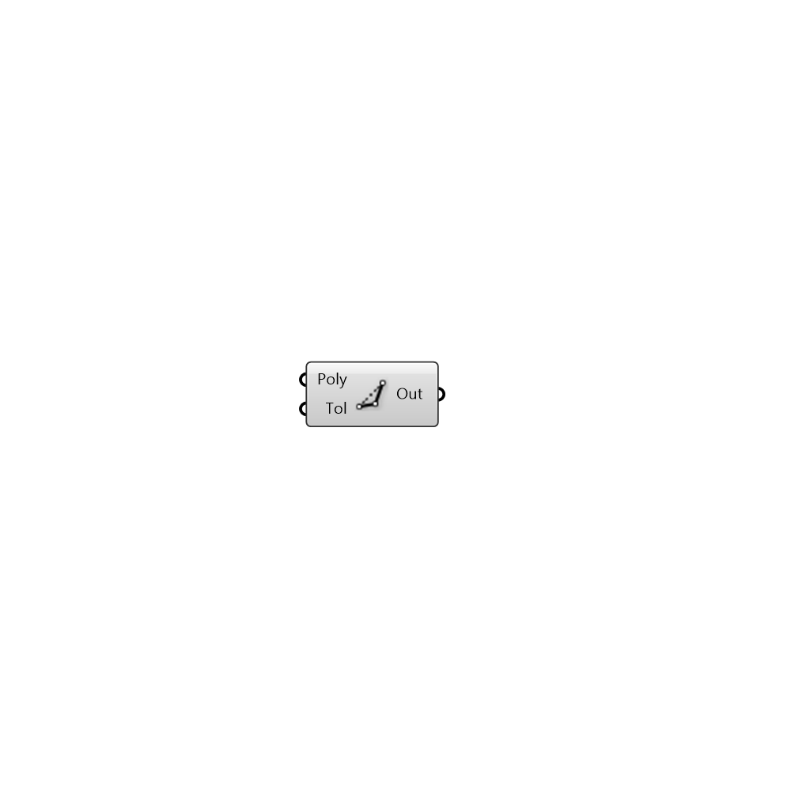

##  Simplify Polyline

Simplify polyline using Douglas Peucker reduction

#### Inputs
* ##### Poly []
Polyline to simplify
* ##### Tol []
Tolerance for Douglas-Peucker reduction

#### Outputs
* ##### Out
Simplified Polyline

[Check Hydra Example Files for Simplify Polyline](https://hydrashare.github.io/hydra/index.html?keywords=Simplify Polyline)