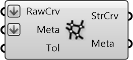

##  Split Street Curves

Split the street curves at intersections

#### Inputs
* ##### RawCrv []
Split Street Curves
* ##### Meta []
Serializable dictionary with string keys and arbitrary values
* ##### Tol []
Tolerance for detecting street intersections

#### Outputs
* ##### StrCrv
Processed Street Curves to form a network with
* ##### Meta
Serializable dictionary with string keys and arbitrary values

[Check Hydra Example Files for Split Street Curves](https://hydrashare.github.io/hydra/index.html?keywords=Split Street Curves)