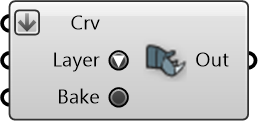

#  Urbano Bake

Bake building/street curves to given layer on Rhino

#### Inputs
* ##### Crv []
Curves to bake to layer
* ##### Layer []
Layer to bake the curves on
* ##### Bake []
Toggle to trigger baking operation

#### Outputs
* ##### Out
Status of baking operation, True for success