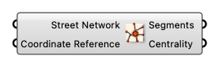

#  Betweenness Centrality

Computes Edge Betweenness Centrality for the Street Network

#### Input
* ##### Street Network [Street Network]
  Street Network
* ##### Coordinate Reference [CR]
  Coordinate reference information for properly locating the geometries in the Rhino canvas

#### Output
* ##### Segments [Curve list]
  List of street segments
* ##### Centrality [Number list]
  List of Betweenness Centrality values corresponding to segments