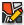
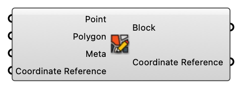

##  Create Block

Create Block

#### Input
* ##### Point [Point]
  Point
* ##### Polygon [Curve]
  Polygon
* ##### Meta [CR]
  Block Meta
* ##### Coordinate Reference [CR]
  Coordinate reference information for properly locating the geometries in the Rhino canvas

#### Output
* ##### Block [Block]
  Block
* ##### Coordinate Reference [CR]
  Coordinate reference information for properly locating the geometries in the Rhino canvas