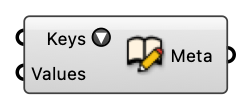

#  Create Metadata

Create metadata from field names (keys) and corresponding values.

#### Input
* ##### Keys [Text list]
  Field names (keys) in the metadata.
* ##### Values [Generic Data list]
  Values corresponding to keys in the metadata.

#### Output
* ##### Meta [CR]
  Dictionary with keys and values that can be attached to Rhino geometries.