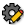
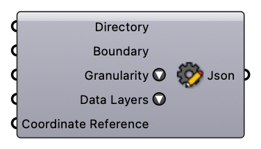

#  Create Project Setting

Create Project Setting

#### Input
* ##### Directory [Text]
  Project directory to save and cache files
* ##### Boundary [Text]
  A string representing geographical boundary
* ##### Granularity [Text]
  Granularity
* ##### Data Layers [Text list]
  Data Layers
* ##### Coordinate Reference [CR]
  Coordinate reference information for properly locating the geometries in the Rhino canvas

#### Output
* ##### Json [Text]
  Json