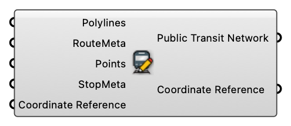

#  Create Public Transit Network

Create Public Transit Network

#### Input
* ##### Polylines [Curve list]
  Route Polylines
* ##### RouteMeta [CR list]
  Route Meta
* ##### Points [Point list]
  Stop Points
* ##### StopMeta [CR list]
  Stop Meta
* ##### Coordinate Reference [CR]
  Coordinate reference information for properly locating the geometries in the Rhino canvas

#### Output
* ##### Public Transit Network [Public Transit Network]
  Public Transit Network
* ##### Coordinate Reference [CR]
  Coordinate reference information for properly locating the geometries in the Rhino canvas