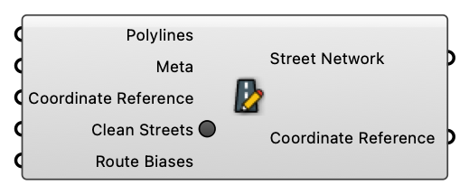

#  Create Street Network

Create Street Network

#### Input
* ##### Polylines [Curve list]
  Street Polylines
* ##### Meta [CR list]
  Street Meta
* ##### Coordinate Reference [CR]
  Coordinate reference information for properly locating the geometries in the Rhino canvas
* ##### Clean Streets [Boolean]
  Clean Streets
* ##### Route Biases [Route Bias list]
  Route Biases

#### Output
* ##### Street Network [Street Network]
  Street Network
* ##### Coordinate Reference [CR]
  Coordinate reference information for properly locating the geometries in the Rhino canvas