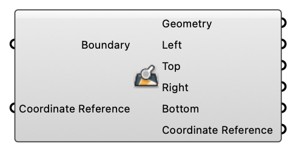

##  Deconstruct Boundary

Deconstruct Boundary

#### Input
* ##### Boundary [Text]
  A string representing geographical boundary
* ##### Coordinate Reference [CR]
  Coordinate reference information for properly locating the geometries in the Rhino canvas

#### Output
* ##### Geometry [Curve]
  Geometry
* ##### Left [Number]
  Minimum longitude, left boundary.
* ##### Top [Number]
  Maximum latitude, top boundary.
* ##### Right [Number]
  Maximum longitude, right boundary.
* ##### Bottom [Number]
  Minimum latitude, bottom boundary.
* ##### Coordinate Reference [CR]
  Coordinate reference information for properly locating the geometries in the Rhino canvas