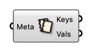

#  Deconstruct Metadata

Deconstruct Metadata into keys and values

#### Input
* ##### Meta [CR]
  Dictionary with keys and values that can be attached to Rhino geometries.

#### Output
* ##### Keys [Text list]
  Keys in metadata
* ##### Vals [Generic Data list]
  Values in metadata