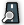
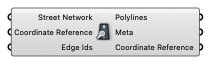

#  Deconstruct Street Network

Deconstruct Street Network

#### Input
* ##### Street Network [Street Network]
  Street Network
* ##### Coordinate Reference [CR]
  Coordinate reference information for properly locating the geometries in the Rhino canvas
* ##### Edge Ids [Integer list]
  Only inspect selected Edge Ids

#### Output
* ##### Polylines [Curve list]
  Street Polylines
* ##### Meta [CR list]
  Street Meta
* ##### Coordinate Reference [CR]
  Coordinate reference information for properly locating the geometries in the Rhino canvas