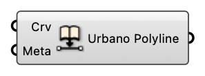

#  Embed Metadata into Curve

Embed Metadata into curve

#### Input
* ##### Crv [Curve]
  Curve to embed metadata to
* ##### Meta [CR]
  Dictionary with keys and values that can be attached to Rhino geometries.

#### Output
* ##### Urbano Polyline [Urbano Polyline]
  Urbano Polyline