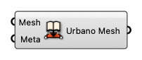

#  Embed Metadata into Mesh

Embed Metadata into mesh

#### Input
* ##### Mesh [Mesh face]
  Mesh to embed metadata to
* ##### Meta [CR]
  Dictionary with keys and values that can be attached to Rhino geometries.

#### Output
* ##### Urbano Mesh [Urbano Mesh]
  Urbano Mesh