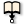
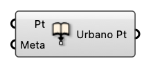

#  Embed Metadata into Point

Embed metadata into point

#### Input
* ##### Pt [Point]
  Point to embed metadata into
* ##### Meta [CR]
  Dictionary with keys and values that can be attached to Rhino geometries.

#### Output
* ##### Urbano Pt [Urbano Point]
  Urbano Pt