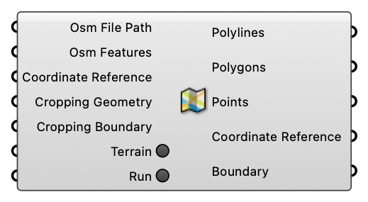

##  Import OSM File

Import OSM File

#### Input
* ##### Osm File Path [Text]
  Osm File Path
* ##### Osm Features [Text list]
  Osm Features
* ##### Coordinate Reference [CR]
  Coordinate reference information for properly locating the geometries in the Rhino canvas
* ##### Cropping Geometry [Curve]
  Cropping Geometry
* ##### Cropping Boundary [Text]
  A string representing geographical boundary. (Use 'Geo Boundary' component to get the string)
* ##### Terrain [Boolean]
  If turned on, the component will try to download corresponding terrain data files into the parent folderof the user-specified file path.
* ##### Run [Boolean]
  Run

#### Output
* ##### Polylines [Geometry list]
  Polylines
* ##### Polygons [Geometry list]
  Polygons
* ##### Points [Geometry list]
  Points
* ##### Coordinate Reference [CR]
  Coordinate reference information for properly locating the geometries in the Rhino canvas
* ##### Boundary [Text]
  A string representing geographical boundary