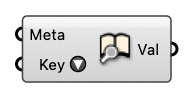

#  Lookup Metadata

Find values corresponding to keys in metadata (or Rhino geometry with metadata embedded)

#### Input
* ##### Meta [CR]
  Metadata to lookup. Can also be Curve/MetaPoint with metadata embedded in it.
* ##### Key [Text]
  Key to search in metadata

#### Output
* ##### Val [Generic Data]
  Value for given key in metadata