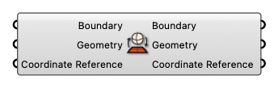

#  Project Geographic Boundary

Project geographic boundary

#### Input
* ##### Boundary [Text]
  A string representing geographical boundary
* ##### Geometry [Curve]
  Geometry
* ##### Coordinate Reference [CR]
  Coordinate reference information for properly locating the geometries in the Rhino canvas

#### Output
* ##### Boundary [Text]
  A string representing geographical boundary
* ##### Geometry [Curve]
  Geometry
* ##### Coordinate Reference [CR]
  Coordinate reference information for properly locating the geometries in the Rhino canvas