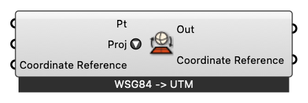

#  Project Geographic Point

Project geographic points between WSG84 (lat,long) and UTM coords

#### Input
* ##### Pt [Point]
  Point to project
* ##### Proj [Text]
  Project geograhic points from Lat-long (WSG84) to UTM and vice-versa
* ##### Coordinate Reference [CR]
  Coordinate reference information for properly locating the geometries in the Rhino canvas

#### Output
* ##### Out [Point]
  Projected Point
* ##### Coordinate Reference [CR]
  Coordinate reference information for properly locating the geometries in the Rhino canvas