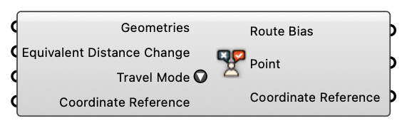

##  Route Biases

Route Biases

#### Input
* ##### Geometries [Geometry]
  Geometries
* ##### Equivalent Distance Change [Number]
  Equivalent change in the perceived distance (+/- meter) for each element on the street segment.
* ##### Travel Mode [Text]
  Travel Mode
* ##### Coordinate Reference [CR]
  Coordinate reference information for properly locating the geometries in the Rhino canvas

#### Output
* ##### Route Bias [Route Bias]
  Route Bias
* ##### Point [Point]
  Point
* ##### Coordinate Reference [CR]
  Coordinate reference information for properly locating the geometries in the Rhino canvas